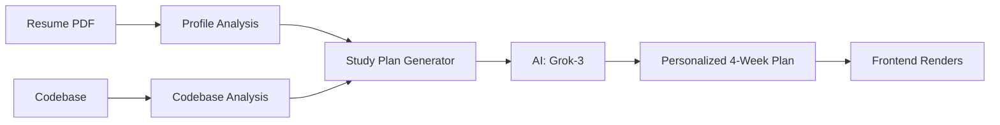

# 🎓 Personalized Study Plan Generation - Quick Start

## What We Built

You now have a **complete personalized onboarding system** that:

✅ **Analyzes resumes** → Understands candidate's skills, experience, and knowledge gaps  
✅ **Analyzes codebases** → Breaks down repositories into learnable chapters  
✅ **Generates custom study plans** → Creates week-by-week onboarding tailored to each person  
✅ **Matches frontend format** → Output ready for `client/lib/data/week-content.ts`

---

## 🚀 Complete Workflow

### 1️⃣ Analyze a Resume

```bash
curl -X POST http://localhost:8080/api/analyzeResume \
  -F "resume=@resume.pdf" \
  -F "candidate_email=candidate@example.com"
```

**Returns:**
```json
{
  "profile_id": "abc123def456",
  "analysis": {
    "candidate_name": "Elon Musk",
    "experience_years": 5,
    "technical_skills": {...},
    "knowledge_gaps": [
      "Limited distributed systems experience",
      "Basic cloud platforms knowledge"
    ]
  }
}
```

### 2️⃣ Generate Personalized Study Plan

```bash
curl -X POST http://localhost:8080/api/generateStudyPlan \
  -F "profile_id=abc123def456" \
  -F "repo_url=https://github.com/facebook/rocksdb" \
  -F "duration_weeks=4" \
  -F "use_ai=true"
```

**Returns:**
```json
{
  "success": true,
  "plan_id": "abc123def456_rocksdb_20251207",
  "plan": {
    "weeks": [
      {
        "weekId": 1,
        "title": "Foundations & Setup",
        "status": "start",
        "overview": "# Overview\n\nPersonalized content...",
        "chapters": [...],
        "tasks": [...]
      }
    ]
  }
}
```

### 3️⃣ Frontend Renders the Plan

The generated plan **exactly matches** the frontend format:

```typescript
// client/lib/data/week-content.ts
export type WeekContent = {
  weekId: number;
  title: string;
  status: "completed" | "continue" | "start" | "locked";
  overview: string; // Markdown
  chapters: Chapter[];
  tasks: WeeklyTask[];
}
```

**Your frontend can now use the personalized plan instead of static data!**

---

## 🧪 Test It Now

```bash
# Start the server
python3 main.py

# Run the demo (in another terminal)
python3 examples/test_study_plan_generator.py
```

**Expected Output:**
```
🎓 Testing Study Plan Generation
============================================================

📤 Step 1: Uploading resume for analysis...
✅ Resume analyzed successfully!
   Profile ID: a15738300dde
   Candidate: Elon Musk
   
📊 Identified Knowledge Gaps:
   • Limited distributed systems experience
   • Basic cloud platforms knowledge
   
🎯 Step 2: Generating personalized study plan...
✅ Study plan generated successfully!

📚 PERSONALIZED STUDY PLAN
Week 1: Foundations & Setup (2 chapters, 2 tasks)
Week 2: Core Concepts (2 chapters, 2 tasks)
Week 3: Advanced Topics (1 chapter, 1 task)
Week 4: Summary & Next Steps (1 chapter, 1 task)

📁 Full plan saved to: examples/output/study_plan_*.json
```

---

## 📊 What Gets Generated

### Week Structure
Each week contains:
- **Overview** - Markdown content explaining the week's focus
- **Chapters** - 2-4 learning chapters with detailed content and subsections
- **Tasks** - 1-3 actionable tasks with progress tracking

### Personalization
The plan is customized based on:
- **Knowledge Gaps** (from resume) → Addressed in early weeks
- **Experience Level** → Difficulty adjusted accordingly
- **Codebase Complexity** → Mapped to user's background
- **Technologies** → Focus areas aligned with gaps

---

## 🎯 How It Works



1. **Resume Analysis** extracts skills, gaps, experience
2. **Codebase Analysis** provides available learning chapters
3. **AI Generator** (Grok) creates personalized plan addressing gaps
4. **Output** matches frontend format exactly
5. **Frontend** renders the customized onboarding experience

---

## 📁 Files & Storage

### Backend Files
```
services/study_plan_generator.py     # Core generator service
main.py                              # API endpoint
examples/test_study_plan_generator.py # Demo script
```

### Generated Data
```
data/
├── analyzed_profiles/               # Resume analyses
│   └── {profile_id}.json
├── codebase_analyses/              # Repo analyses
│   └── {repo}_{timestamp}.json
└── study_plans/                    # Generated plans
    └── {profile_id}_{repo}_{timestamp}.json
```

---

## 🔌 Frontend Integration

### Replace Static Data

**Before:**
```typescript
// client/lib/data/week-content.ts
export const weekContents: WeekContent[] = [
  // Static mock data
];
```

**After:**
```typescript
// Fetch personalized plan
const response = await fetch('/api/generateStudyPlan', {
  method: 'POST',
  body: formData
});

const { plan } = await response.json();
const weekContents: WeekContent[] = plan.weeks;

// Use with existing components - they expect this format!
<WeekSelector weeks={weekContents} />
```

---

## 🛠️ Configuration

### AI vs Fallback Mode

**AI Mode** (Recommended - requires Grok API):
```python
use_ai=True  # Highly personalized, context-aware
```

**Fallback Mode** (No API key needed):
```python
use_ai=False  # Template-based but functional
```

### Adjust Duration

```bash
# Generate 8-week plan instead of 4
curl -X POST http://localhost:8080/api/generateStudyPlan \
  -F "duration_weeks=8"
```

---

## 📚 Documentation

- **[Full Documentation](./docs/STUDY_PLAN_GENERATION.md)** - Complete API reference
- **[Implementation Summary](./docs/STUDY_PLAN_IMPLEMENTATION.md)** - Architecture details
- **[API Reference](./docs/API_REFERENCE.md)** - All endpoints

---

## ✨ Example Output Preview

```json
{
  "weeks": [
    {
      "weekId": 1,
      "title": "Foundations & Setup",
      "status": "start",
      "overview": "# Welcome!\n\nThis week addresses your C++ knowledge gap...",
      "chapters": [
        {
          "id": "cpp-basics",
          "title": "C++ Fundamentals",
          "content": "# C++ Fundamentals\n\n## Pointers and References..."
        }
      ],
      "tasks": [
        {
          "id": "task-1-1",
          "title": "Complete C++ Tutorial",
          "description": "Review C++ basics focusing on memory management...",
          "progress": 0
        }
      ]
    }
  ]
}
```

---

## 🎉 Next Steps

1. ✅ **Test the system** - Run `python3 examples/test_study_plan_generator.py`
2. ✅ **Review generated plans** - Check `examples/output/`
3. 🔜 **Integrate frontend** - Replace static week-content.ts with API calls
4. 🔜 **Deploy** - Use with real candidates
5. 🔜 **Collect feedback** - Improve plan quality over time

---

## 🤝 Contributing

To customize the study plan generation:

1. **Modify AI Prompt** - Edit `services/study_plan_generator.py`
2. **Add Week Templates** - Extend `generate_fallback_plan()`
3. **Adjust Difficulty** - Customize week progression logic
4. **Add Resources** - Include learning materials in tasks

---

**🚀 You now have a production-ready personalized onboarding system!**

The output format perfectly matches your frontend's expectations, making integration seamless.
