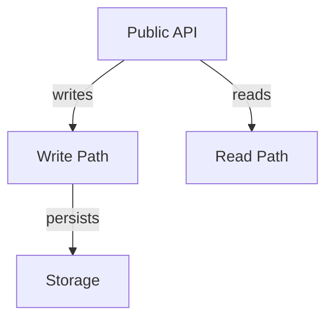

# API Schema Documentation

This document describes the schema returned by the `getCodeBaseSummary` API endpoint. Frontend developers can use this to render wiki pages for codebase onboarding.

## Response Structure

### Top Level
```typescript
{
  wiki: WikiDocument
}
```

### WikiDocument

A complete wiki document containing all information about a codebase.

```typescript
interface WikiDocument {
  meta: MetaData;
  summary: Summary;
  architecture: Architecture;
  workflows: Workflow[];
  modules: Module[];
  operational_readiness: OperationalReadiness;
  getting_started: GettingStarted;
  faq: FAQ[];
}
```

---

## Detailed Schema

### 1. MetaData

Repository metadata and identification.

```typescript
interface MetaData {
  name: string;                    // Repository/project name
  repo_url: string;                // Canonical GitHub URL
  language: string[];              // Primary programming languages
  last_indexed_iso: string;        // ISO 8601 timestamp of last analysis
  maintainers: Maintainer[];       // Team/people responsible
}

interface Maintainer {
  name: string;                    // Team or person name
  contact: string;                 // Email or Slack handle
}
```

**Frontend Usage:**
- Display as header/hero section
- Show language badges
- Display "Last updated" timestamp
- Link to maintainer contacts

---

### 2. Summary

High-level overview of the codebase.

```typescript
interface Summary {
  one_liner: string;               // Elevator pitch (1 sentence)
  problem_solved: string[];        // List of problems this code solves
  architecture_overview: string;   // Paragraph describing the overall design
}
```

**Frontend Usage:**
- `one_liner`: Display prominently as subtitle
- `problem_solved`: Render as bullet list
- `architecture_overview`: Show as introduction paragraph

---

### 3. Architecture

Visual architecture representation.

```typescript
interface Architecture {
  components: Component[];         // Nodes in the architecture graph
  edges: Edge[];                   // Connections between components
  callouts: Callout[];            // Important notes/highlights
}

interface Component {
  id: string;                      // Unique identifier (use for graph node ID)
  label: string;                   // Display name
  description: string;             // Brief explanation
}

interface Edge {
  source: string;                  // Component ID (matches component.id)
  target: string;                  // Component ID (matches component.id)
  label: string;                   // Relationship description (e.g., "writes", "reads")
}

interface Callout {
  title: string;                   // Section title
  bullets: string[];               // List of important points
}
```

**Frontend Usage:**

**Graph Visualization:**
Use `components` and `edges` to create an interactive diagram with:
- **D3.js**: Network graph
- **Mermaid**: Markdown-based diagram
- **React Flow**: Interactive node editor
- **Cytoscape.js**: Graph theory visualization

Example with Mermaid:


**Callouts:**
- Render as info boxes/cards
- Use icons for visual interest
- Highlight important configuration points

---

### 4. Workflows

Common data flows and processes.

```typescript
interface Workflow {
  name: string;                    // Workflow name (e.g., "Write flow")
  steps: string[];                 // Ordered list of steps
}
```

**Frontend Usage:**
- Render as numbered lists
- Use step indicators (1 → 2 → 3)
- Consider accordion/collapse for space
- Visual timeline or flowchart

Example visualization:
```
Write Flow
1 → Client issues WriteBatch
2 → Batch appended to WAL
3 → MemTable marked immutable
4 → Flush job writes SSTable
```

---

### 5. Modules

Key files/components with ownership information.

```typescript
interface Module {
  path: string;                    // File path (e.g., "db/db_impl.cc")
  role: string;                    // What this module does
  owner: string;                   // Team responsible
  risky_changes: string[];         // Warning: areas requiring caution
}
```

**Frontend Usage:**
- Display as table or card grid
- Add search/filter by owner or path
- Use warning icons for `risky_changes`
- Link to GitHub file if possible

Example table:
| Path | Role | Owner | Risky Areas |
|------|------|-------|-------------|
| db/db_impl.cc | Core DB implementation | storage-runtime | ⚠️ Threading, WAL |

---

### 6. OperationalReadiness

Production monitoring and troubleshooting.

```typescript
interface OperationalReadiness {
  metrics: Metric[];               // What to monitor
  runbooks: Runbook[];            // How to fix common issues
}

interface Metric {
  name: string;                    // Metric identifier
  why: string;                     // Why this matters
}

interface Runbook {
  title: string;                   // Problem/scenario
  summary: string;                 // Solution steps
}
```

**Frontend Usage:**

**Metrics:**
- Display as monitoring dashboard section
- Add copy buttons for metric names
- Group by category if many metrics

**Runbooks:**
- Searchable troubleshooting guide
- Expand/collapse for details
- Link to full documentation

---

### 7. GettingStarted

Developer onboarding information.

```typescript
interface GettingStarted {
  dev_setup: string[];             // Setup instructions
  sample_usage: string;            // Code example
}
```

**Frontend Usage:**
- Render `dev_setup` as step-by-step guide
- Show `sample_usage` in syntax-highlighted code block
- Add "Copy to clipboard" button
- Link to full documentation

---

### 8. FAQ

Frequently asked questions.

```typescript
interface FAQ {
  q: string;                       // Question
  a: string;                       // Answer
}
```

**Frontend Usage:**
- Accordion/collapse UI
- Search functionality
- "Was this helpful?" feedback buttons

---

## Example Frontend Implementation

### React Component Structure

```typescript
function WikiPage({ wiki }: { wiki: WikiDocument }) {
  return (
    <div>
      <Header meta={wiki.meta} summary={wiki.summary} />
      <ArchitectureSection architecture={wiki.architecture} />
      <WorkflowsSection workflows={wiki.workflows} />
      <ModulesSection modules={wiki.modules} />
      <OperationsSection ops={wiki.operational_readiness} />
      <GettingStartedSection setup={wiki.getting_started} />
      <FAQSection faqs={wiki.faq} />
    </div>
  );
}
```

### Markdown Rendering

If using static site generators (Jekyll, Hugo, Docusaurus):

```markdown
# {{wiki.meta.name}}

> {{wiki.summary.one_liner}}

## Architecture

{{#each wiki.architecture.components}}
- **{{label}}**: {{description}}
{{/each}}

## Workflows

{{#each wiki.workflows}}
### {{name}}
{{#each steps}}
{{@index}}. {{this}}
{{/each}}
{{/each}}
```

---

## Recommended UI Libraries

### Graph Visualization
- [D3.js](https://d3js.org/) - Powerful, customizable
- [React Flow](https://reactflow.dev/) - React-native graph library
- [Mermaid](https://mermaid.js.org/) - Markdown diagrams
- [Cytoscape.js](https://js.cytoscape.org/) - Complex networks

### Documentation Frameworks
- [Docusaurus](https://docusaurus.io/) - Facebook's doc framework
- [VitePress](https://vitepress.dev/) - Vue-powered static site
- [GitBook](https://www.gitbook.com/) - Beautiful docs platform
- [Nextra](https://nextra.site/) - Next.js-based docs

### Component Libraries
- [shadcn/ui](https://ui.shadcn.com/) - Beautiful React components
- [Ant Design](https://ant.design/) - Enterprise UI library
- [Material-UI](https://mui.com/) - Google's Material Design

---

## Full TypeScript Definitions

```typescript
// Complete type definitions for the API response

export interface WikiApiResponse {
  wiki: WikiDocument;
}

export interface WikiDocument {
  meta: MetaData;
  summary: Summary;
  architecture: Architecture;
  workflows: Workflow[];
  modules: Module[];
  operational_readiness: OperationalReadiness;
  getting_started: GettingStarted;
  faq: FAQ[];
}

export interface MetaData {
  name: string;
  repo_url: string;
  language: string[];
  last_indexed_iso: string;
  maintainers: Maintainer[];
}

export interface Maintainer {
  name: string;
  contact: string;
}

export interface Summary {
  one_liner: string;
  problem_solved: string[];
  architecture_overview: string;
}

export interface Architecture {
  components: Component[];
  edges: Edge[];
  callouts: Callout[];
}

export interface Component {
  id: string;
  label: string;
  description: string;
}

export interface Edge {
  source: string;
  target: string;
  label: string;
}

export interface Callout {
  title: string;
  bullets: string[];
}

export interface Workflow {
  name: string;
  steps: string[];
}

export interface Module {
  path: string;
  role: string;
  owner: string;
  risky_changes: string[];
}

export interface OperationalReadiness {
  metrics: Metric[];
  runbooks: Runbook[];
}

export interface Metric {
  name: string;
  why: string;
}

export interface Runbook {
  title: string;
  summary: string;
}

export interface GettingStarted {
  dev_setup: string[];
  sample_usage: string;
}

export interface FAQ {
  q: string;
  a: string;
}
```

---

## Validation

Use this Zod schema for runtime validation:

```typescript
import { z } from 'zod';

const MetaDataSchema = z.object({
  name: z.string(),
  repo_url: z.string().url(),
  language: z.array(z.string()),
  last_indexed_iso: z.string(),
  maintainers: z.array(z.object({
    name: z.string(),
    contact: z.string(),
  })),
});

const SummarySchema = z.object({
  one_liner: z.string(),
  problem_solved: z.array(z.string()),
  architecture_overview: z.string(),
});

const ArchitectureSchema = z.object({
  components: z.array(z.object({
    id: z.string(),
    label: z.string(),
    description: z.string(),
  })),
  edges: z.array(z.object({
    source: z.string(),
    target: z.string(),
    label: z.string(),
  })),
  callouts: z.array(z.object({
    title: z.string(),
    bullets: z.array(z.string()),
  })),
});

export const WikiDocumentSchema = z.object({
  meta: MetaDataSchema,
  summary: SummarySchema,
  architecture: ArchitectureSchema,
  workflows: z.array(z.object({
    name: z.string(),
    steps: z.array(z.string()),
  })),
  modules: z.array(z.object({
    path: z.string(),
    role: z.string(),
    owner: z.string(),
    risky_changes: z.array(z.string()),
  })),
  operational_readiness: z.object({
    metrics: z.array(z.object({
      name: z.string(),
      why: z.string(),
    })),
    runbooks: z.array(z.object({
      title: z.string(),
      summary: z.string(),
    })),
  }),
  getting_started: z.object({
    dev_setup: z.array(z.string()),
    sample_usage: z.string(),
  }),
  faq: z.array(z.object({
    q: z.string(),
    a: z.string(),
  })),
});
```

---

## Error Handling

The API may return these errors:

### 400 Bad Request
```json
{
  "error": "missing codebase_url"
}
```

**Cause:** The `codebase_url` query parameter was not provided.

### 404 Not Found
```json
{
  "error": "codebase not indexed"
}
```

**Cause:** The requested repository has not been analyzed yet.

### Frontend Error Handling Example

```typescript
async function fetchWiki(repoUrl: string): Promise<WikiDocument> {
  const response = await fetch(
    `${API_URL}/api/getCodeBaseSummary?codebase_url=${encodeURIComponent(repoUrl)}`
  );

  if (!response.ok) {
    const error = await response.json();
    throw new Error(error.error || 'Failed to fetch wiki');
  }

  const data = await response.json();
  return data.wiki;
}
```

---

## Sample Queries

### Available Repositories

Currently indexed (prototype data):
- `https://github.com/facebook/rocksdb`

### Full cURL Example

```bash
curl -X GET \
  'http://localhost:8080/api/getCodeBaseSummary?codebase_url=https://github.com/facebook/rocksdb' \
  -H 'Accept: application/json'
```

### JavaScript Fetch Example

```javascript
const repoUrl = 'https://github.com/facebook/rocksdb';
const response = await fetch(
  `http://localhost:8080/api/getCodeBaseSummary?codebase_url=${encodeURIComponent(repoUrl)}`
);
const { wiki } = await response.json();
console.log(wiki);
```
