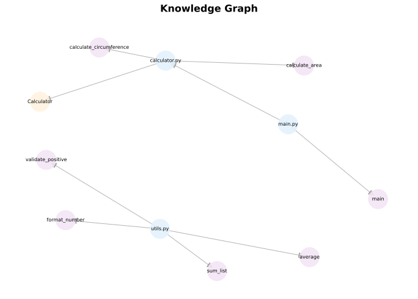
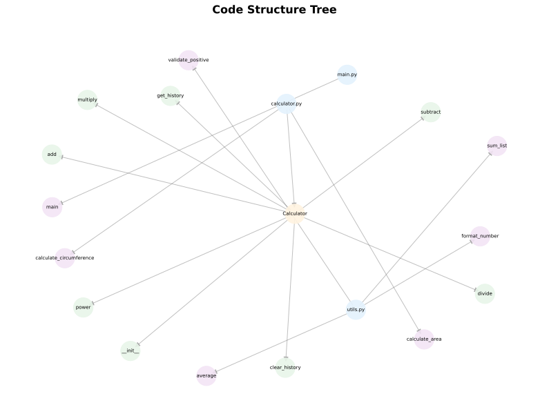

# Codebase Analysis Report

*Generated on: 2025-12-07 00:26:24*

## Summary

### Codebase Summary

#### 1. What the Project Does
This is a simple Python-based calculator application designed for demonstrating basic arithmetic operations and geometric calculations. It serves as a demo tool that performs calculations like addition, multiplication, and exponentiation, computes circle area and circumference, tracks a history of operations, and includes utility functions for number formatting and list processing. The project is educational and lightweight, with a command-line interface for running examples.

#### 2. Main Technologies and Frameworks Used
- **Language**: Python (standard library usage, no external frameworks).
- **Modules**: 
  - `math` (for mathematical functions like `pow` and `pi`).
  - `typing` (for type hints, e.g., `List[float]`).
- No third-party libraries or frameworks are involved; it's pure Python code.

#### 3. Overall Architecture
The codebase follows a modular, object-oriented design with separation of concerns:
- **Entry Point**: `main.py` acts as the main script, importing and orchestrating components to run a demo.
- **Core Logic**: `calculator.py` contains the `Calculator` class (for arithmetic operations and history tracking) and standalone functions (for circle calculations).
- **Utilities**: `utils.py` provides helper functions for formatting, validation, and aggregation.
- **Structure**: 3 files, 1 class, and 7 functions. It's flat and easy to extend, with no complex dependencies or patterns like MVC.

#### 4. Key Features and Capabilities
- **Basic Arithmetic**: Supports addition, subtraction, multiplication, division, and exponentiation via the `Calculator` class, with error handling (e.g., division by zero).
- **History Tracking**: Maintains a log of calculations, retrievable or clearable.
- **Geometric Calculations**: Computes circle area and circumference using the `math` module.
- **Utilities**: Includes functions for number formatting (to specified decimals), positive value validation, summing lists, and calculating averages.
- **Demo Interface**: Command-line output in `main.py` showcases features with sample inputs and results.
- **Extensibility**: Simple design allows easy addition of new operations or utilities without major refactoring.


## Codebase Structure

```
Codebase Structure:
- 3 files analyzed
- 1 classes
- 7 functions

Main Modules:
  - calculator.py
  - main.py
  - utils.py
```


## Key Abstractions and Patterns

### Calculator Class (abstraction)

An abstraction that encapsulates the state and behavior of a calculator, including basic arithmetic operations and history tracking. It provides a reusable object-oriented interface for performing calculations while maintaining a record of operations.

**Related Files:**
- `calculator.py`
- `main.py`

**Examples:**
```python
calc = Calculator()
```
```python
result = calc.add(10, 5)
```

### History Management (design_pattern)

A simple state management mechanism within the Calculator class to log and retrieve past calculations. It uses a list to store operation records, allowing for auditing and replaying of actions, resembling a basic command or memento pattern for tracking state changes.

**Related Files:**
- `calculator.py`
- `main.py`

**Examples:**
```python
self.history.append(f"{a} + {b} = {result}")
```
```python
for entry in calc.get_history(): print(f"  - {entry}")
```

### Utility Functions (abstraction)

Standalone functional abstractions for common tasks like number formatting, validation, and aggregation. These are pure functions that promote code reusability and separation of concerns by handling auxiliary operations outside the core calculator logic.

**Related Files:**
- `utils.py`

**Examples:**
```python
def format_number(num: float, decimals: int = 2) -> str:
```
```python
def average(numbers: List[float]) -> float:
```

### Main Entry Point (architecture)

An architectural pattern for the application's entry point, organizing the demo logic into a main function that instantiates components and orchestrates the flow. It follows a script-like structure common in Python applications for initialization and execution.

**Related Files:**
- `main.py`

**Examples:**
```python
def main():
```
```python
if __name__ == "__main__": main()
```

### Modular Structure (architecture)

An architectural component that organizes the codebase into separate modules (calculator.py for core logic, utils.py for helpers, main.py for entry). This promotes maintainability, reusability, and separation of concerns by grouping related functionalities.

**Related Files:**
- `calculator.py`
- `utils.py`
- `main.py`

**Examples:**
```python
from calculator import Calculator, calculate_area, calculate_circumference
```
```python
from utils import format_number, validate_positive
```

## Knowledge Graph

The knowledge graph contains **11 nodes** and **9 edges**, 
representing the relationships between modules, classes, functions, and files in the codebase.


**Node Types:**
- file: 3
- class: 1
- function: 7

**Relationship Types:**
- contains: 8
- imports: 1


## Visualizations

### Dependency Graph

The dependency graph shows how different modules and files depend on each other. 
Arrows indicate import relationships, helping you understand the module hierarchy and dependencies.


### Knowledge Graph Visualization

This visualization represents the complete knowledge graph of the codebase, showing all components 
(files, classes, functions) and their relationships. Different colors represent different types of components.





### Code Structure Tree

The structure tree provides a hierarchical view of the codebase organization, showing how files contain 
classes and functions, and how classes contain methods. This helps understand the overall architecture.





## Analysis Metadata

- **Files Analyzed:** 3
- **Model Used:** grok-code-fast-1
- **Root Path:** `C:\Users\kaiva\OnboardingxGrok\test_example`

